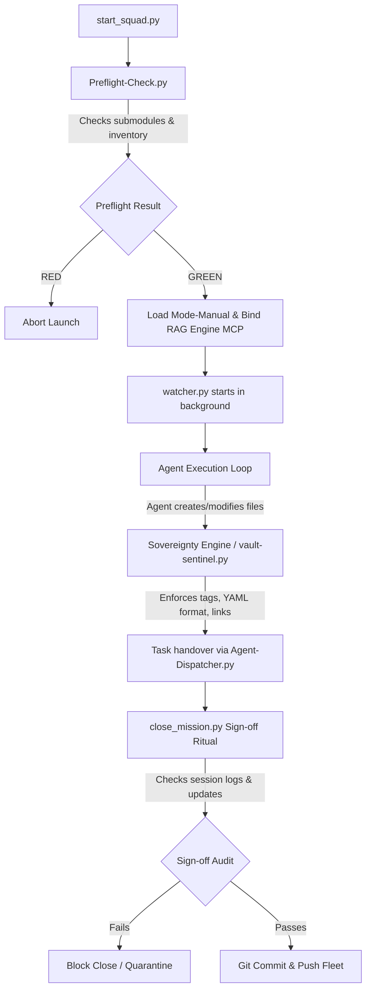
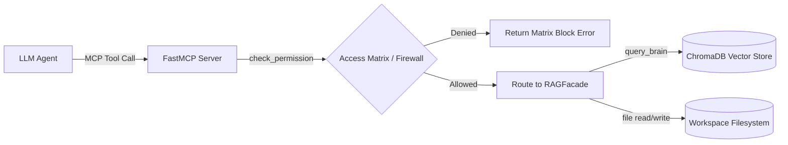

# 🌌 Obsidian-Brain: Ecosystem Architecture & Functional Analysis

This document provides a deep structural and functional analysis of the `obsidian-brain` ecosystem. It explains the interactions between the Python automation scripts, the Markdown configuration and telemetry files, the governance models, and the local sovereign RAG engine.

---

## 🗺️ 1. Double-Digit Folder Architecture (PARA/Diátaxis Hybrid)

The Obsidian Vault utilizes a strict double-digit prefix system to enforce segregation of concern, predictability of directory crawl scopes, and selective firewalling.

| Folder | Architectural Purpose | Governance Level | AI Access Control (Exclusion Firewall) |
| :--- | :--- | :--- | :--- |
| `00-AI-Orchestration` | Meta-governance, active session states, project DNA, operational mode configs. | **Active / Mutable** | Always readable; protected from external writes. |
| `01-Strategic-Nexus` | AI-generated strategic audits, anti-backlogs, pattern trackers. | **Active / Fluid** | Excluded in Modes 1, 2, and 3. |
| `02-Business-BDD` | Behavior-driven specification files (`FEAT-*.md`), domain glossaries. | **Immutable (Zone 1)** | Always readable in Mode 1 (Frozen Specs). |
| `03-Tech-Stack` | Architecture Decision Records (ADRs), naming conventions, coding standards. | **Immutable (Zone 3)** | Excluded in Mode 1. |
| `04-Rapid-Prototyping` | Code playgrounds, fluid experiments. | **Fluid (Zone 2)** | Excluded in Modes 1 and 3. |
| `05-Fleet-Operation` | Global inventory registry (`inventory.json`), deployment logs. | **Active / Ops (Zone 3)**| Excluded in Modes 1 and 2. |
| `06-Microservices` | Service hub files detailing microservice states, APIs, and schemas. | **Active** | Excluded in Mode 2. |
| `07-Core-KMS` | Role prompts, workflows, and core audit/dispatcher scripts. | **Governance / Rules** | Excluded from editing by AI. |
| `10-State-and-Tasks` | Task inbox (foundry) and task state boards. | **Active** | Read/write allowed. |
| `20-Scripts` | Core automation, launchers, and local orchestration scripts. | **Ecosystem Automation** | Hidden from AI processes (Global Exclude). |
| `99-Humans` | Operator onboarding files, manual testing logs, sprint dashboards. | **Human-Only** | Globally ignored via `#ai/ignore` and RAG exclusions. |

---

## 🔄 2. Vault Orchestration and Governance Workflow

The lifecycle of an AI agent session inside the vault follows a structured loop, managed by Python scripts that audit, execute, and seal workspace changes.

---

## 🛡️ 3. Core Governance Engine: `Sovereignty`

Located in `20-Scripts/lib/sovereignty.py`, this class provides the central logic for auditing and fixing files. It is imported by the Sentinel, Fleet Commander, and Preflight checks to guarantee zero metadata drift.

### A. Tag Taxonomy Enforcement
The system checks if a file possesses a valid `#type/` and `#state/` tag, validating them against `07-Core-KMS/tag_taxonomy.md`.
- **Auto-Fix Rules**: If tags are present in the YAML body as raw strings (e.g. `type: moc`), the script converts them to standardized hashed tags in the YAML `tags` array (e.g., `- '#type/moc'`).

### B. Link Integrity Verification
Obsidian wikilinks (`[[Note-Name|Alias]]`) are validated to ensure they point to existing markdown files inside the vault.
- **Auto-Fix Rules**: If a link contains directory paths (e.g. `[[03-Tech-Stack/Note]]`), it strips them to standard Obsidian name-only links (`[[Note]]`). It also checks for broken links and registers warnings/errors.

### C. Isolation Zone Governance
Ensures that files containing sensitive human or local configs (`#ai/ignore`) do not get ingested into the RAG context database.

---

## 🕹️ 4. Mode-Based Execution & Context Isolation

The `active_mode` variable in `00-AI-Orchestration/MODE-MANUAL.md` controls the system state. Changing the mode dynamically updates the entire vault behavior.

- **Mode 1: Spec-First**: Reading markdown is disabled. Strictly maps BDD files (Zone 1).
- **Mode 2: Free-Labs**: Full read/write for code & markdown. Fluid zone.
- **Mode 3: Fleet-Commander**: Git sync across repos. Reads code, no md read.
- **Mode 4: Direct-Action**: Bypasses RAG locks; full access.

- **State Sync**: `20-Scripts/switch_mode.py` updates the active mode header in `00-AI-Orchestration/AI-Session-State.md` and instructs the RAG server to swap its active directory exclusion lists to protect restricted zones.

---

## 📋 5. Active Auditing and Maintenance Scripts

The KMS maintains vault health through a series of automated background scripts:

### A. Preflight-Check.py
Runs at squad startup. It validates:
1. Submodule alignment (reports branch mismatches or detached heads).
2. Project inventory portability (reads `inventory.json` and checks if local repositories match actual disk paths).
3. Workspace branch statuses.

### B. Brain-Health-Audit.py & vault-sentinel.py
`Brain-Health-Audit.py` uses `Sovereignty` to perform a full system scan, while `vault-sentinel.py` provides a CLI-friendly wrapper to audit individual directories, reporting broken wikilinks, malformed metadata headers, or untagged notes. Running with `--fix` triggers auto-remediation.

### C. Agent-Dispatcher.py
A semantic routing daemon. It scans the vault recursively looking for notes containing the `#state/pending` tag or `status: pending` header.
- **Scoring System**: Computes a semantic matching score based on keyword densities for each agent role (e.g., matching "assert" or "test" with `qa`; "ADR" or "specification" with `architect`).
- **Handover**: Rewrites the task status to `active` (`#state/active`) and updates the frontmatter's assigned `role`.

### D. Joint-Audit-Purger.py (Dark Matter Purger)
Scans the vault to identify "Dark Matter" (markdown notes that have no incoming Obsidian wikilinks).
- **Protection Rules**: Protects core system nodes (MOCs, strategic nexus files, ADRs, state files) from deletion.
- **Checklist Output**: Saves the candidate list to `PURGE-CANDIDATES.json` and generates a human-readable checklist at `00-AI-Orchestration/PURGE-APPROVAL-REQUEST.md` to obtain authorization before deletion.

### E. Maintenance-Skill.py
A cleanup script that purges stale `AI-Session-State.md` files (older than 30 days) in repositories throughout the fleet, keeping only the central vault session log.

---

## 🔌 6. Sovereign RAG Engine (`08-RAG-Engine`)

A local, offline vector search and permission control layer that runs as an MCP Server.

### Key Components:
1. **FastMCP Server** (`server.py`): Exposes tools like `query_brain()`, `get_brain_stats()`, and `find_similar_files()`, alongside unified filesystem access tools (`read_workspace_file()`, `write_workspace_file()`).
2. **Access Control Matrix & Firewall**:
   - Enforces the `access_matrix.yaml` rules based on the active mode (e.g., blocking markdown read in Mode 1).
   - Enforces directory restrictions, rejecting write calls outside of registered fleet directories.
   - Prevents code modification or reading if restricted by the active mode.
3. **Persisted Vector DB** (`chroma_store.py`): Uses local `sentence-transformers` (`all-MiniLM-L6-v2`) to embed document chunks in a ChromaDB database offline.
4. **File Watcher** (`file_watcher.py`): Observes the filesystem using Python `watchdog`. Debounces file creation/modification events with a `0.5s` quiet-window before invoking the incremental indexer.

---

## 🧠 7. State Management and Attention Restoration

To prevent context degradation across LLM interactions, the ecosystem implements two main protocols:

1. **Mandatory Initialization Prompt** (`00-AI-Orchestration/AI-Init.md`): Directs the agent to load the Ecosystem MOC, Project DNA, and Central Session State immediately.
2. **The `[SCAN]` Protocol**: Every agent response must begin with a structured header indicating its role, source verification status, and active mission stage:
   `**[SCAN]** Role: [agent-role] | Source: [source-repo] | State: [session-progress]`
3. **Hard-Stop Session Logs**: Agents write a summary of their completed tasks to `00-AI-Orchestration/AI-Session-State.md` before closing a session, which serves as a context restoration anchor for the next agent execution.
