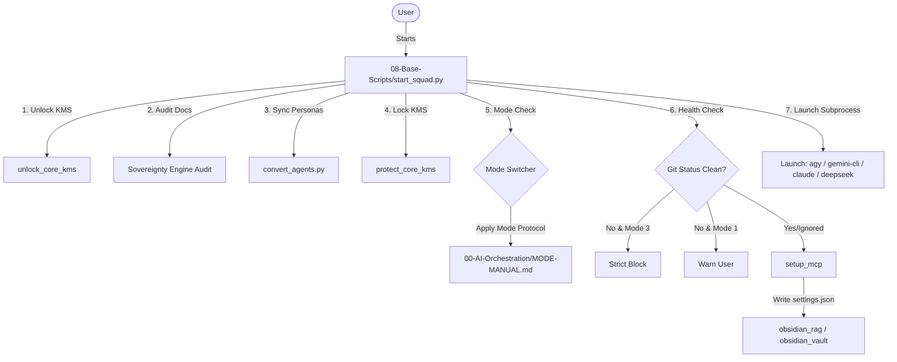

## 🏗️ 1. Global Vault Directory Map
The repository represents an Obsidian knowledge vault with specialized directories mapping strategy, behavior, tech stack standards, and script automation:

| Directory | Type | Description |
| :--- | :--- | :--- |
| **[[00-AI-Orchestration](../../../desktop/Bastien-Antigravity/obsidian-brain/00-AI-Orchestration)]** | Meta-Logic | Global rules, Multi-Mode Manual, and AI Session States. |
| **[[01-Strategic-Nexus](../../../desktop/Bastien-Antigravity/obsidian-brain/01-Strategic-Nexus)]** | Strategy | Long-term analysis, vision, and auditing logs. |
| **[[02-Business-BDD](../../../desktop/Bastien-Antigravity/obsidian-brain/02-Business-BDD)]** | **Zone 1: Frozen** | Behavioral specifications written in Gherkin (BDD specs). |
| **[[03-Tech-Stack](../../../desktop/Bastien-Antigravity/obsidian-brain/03-Tech-Stack)]** | Standards | Architecture standards, schemas, and ADRs. |
| **[[04-Rapid-Prototyping](../../../desktop/Bastien-Antigravity/obsidian-brain/04-Rapid-Prototyping)]** | **Zone 2: Fluid** | Experimental laboratories, prototypes, and sandboxes. |
| **[[05-Fleet-Operation](../../../desktop/Bastien-Antigravity/obsidian-brain/05-Fleet-Operation)]** | **Zone 3: Fleet** | Multi-repo control dashboard, repository inventory, and git logs. |
| **[[06-Microservices](../../../desktop/Bastien-Antigravity/obsidian-brain/06-Microservices)]** | Documentation | Operational documentation for all microservices in the ecosystem. |
| **[[07-Core-KMS](../../../desktop/Bastien-Antigravity/obsidian-brain/07-Core-KMS)]** | KMS OS | Central agent role prompts and templates. |
| **[[08-Base-Scripts](../../../desktop/Bastien-Antigravity/obsidian-brain/08-Base-Scripts)]** | Automation | Script launcher, mode switcher, and preflight audit scripts. |
| **[[09-RAG-Engine](../../../desktop/Bastien-Antigravity/obsidian-brain/09-RAG-Engine)]** | Semantic Search | Python-based ChromaDB vector indexer and FastMCP server. |
| **[[10-Agent-Factory](../../../desktop/Bastien-Antigravity/obsidian-brain/10-Agent-Factory)]** | Scaffolding | Automation to generate/scaffold agent profiles. |
| **[[99-Humans](../../../desktop/Bastien-Antigravity/obsidian-brain/99-Humans)]** | Human Hub | Onboarding guides, testing playbooks, and startup guides. |

---

## 🕹️ 2. How the AI Squad Launch Sequence Works
Instead of running a monolithic python server to talk to models, the system is designed around **delegated workspace interaction** using standard CLI adapters.

### Key Stages in the Launcher ([start_squad.py](../../../desktop/Bastien-Antigravity/obsidian-brain/08-Base-Scripts/start_squad.py)):
1. **Audits and Sovereignty Guard**: Executes `Preflight-Check.py` and `Brain-Health-Audit.py`. Restores write permissions to `07-Core-KMS` during the audit phase and locks it back down to read-only (`chmod 0o444`) afterwards to prevent model tampering.
2. **Persona Compilation**: Automatically runs [convert_agents.py](../../../desktop/Bastien-Antigravity/obsidian-brain/08-Base-Scripts/convert_agents.py). This takes markdown system prompts defined in `07-Core-KMS/Role-Prompts` and compiles them into target directories (`.gemini/agents/`, `.claude/agents/`, `.agents/skills/`, etc.) where the CLI clients can load them.
3. **Multi-Mode Integration**: Configures the Model Context Protocol (MCP) filesystem filters depending on the selected mode:
   * **RAG Mode**: Registers the FastMCP server `obsidian_rag` inside the user's local `settings.json` and `claude_desktop_config.json`.
   * **Basic Mode**: Falls back to the npm `@modelcontextprotocol/server-filesystem` with custom directory exclusions.
4. **Client Subprocess Launch**: Spawns the CLI client subprocess. The AI client then runs inside the terminal, interacting with the files and databases through the active MCP server.

---

## 🎭 3. The 4 Modes of Engagement
Controlled by YAML frontmatter in **[[MODE-MANUAL.md](../../../desktop/Bastien-Antigravity/obsidian-brain/00-AI-Orchestration/MODE-MANUAL.md)]**, the launcher enforces specific constraints:

1. **🛡️ Mode 1: Spec-First**: Focuses on stability. Zero code changes are allowed without an approved BDD spec in `02-Business-BDD`. Enforces strict pre-task git status checkpoints so that developers/agents do not work on dirty codebases without commit/stash safety.
2. **🧪 Mode 2: Free-Labs**: High-speed experimentation. BDD is optional. Development occurs in `04-Rapid-Prototyping`. Allows experimental tool capabilities (like browser-use or url-fetch) which are banned in other modes. Requires a "Graduation Ceremony" (writing specs/docs) to move code to production.
3. **🛰️ Mode 3: Agent Orchestrator (Fleet-Commander)**: Enforces multi-repo synchronization across the 29 repositories. Uncommitted git changes in any fleet repository will strictly block startup.
4. **🥷 Mode 4: Direct-Action**: Bypasses mode state tracking. Stateless, fast interaction for simple file edits or Q&A.

---

## 🛡️ 4. The Sovereignty Validation Engine
The file **[[sovereignty.py](../../../desktop/Bastien-Antigravity/obsidian-brain/08-Base-Scripts/lib/sovereignty.py)]** contains the compliance checker:
- **YAML Compliance**: Verifies every markdown note starts with YAML frontmatter specifying `microservice`, `type`, and `status`.
- **Taxonomy Validation**: Enforces standard tagging formats. Recommends `#type/` and `#state/`, and demands at least one transversal category from `#tech/`, `#tier/`, or `#zone/`.
- **Isolation Protection**: Checks that each sibling repository contains a `quick-overview` documentation directory, and the brain contains `99-Humans` to avoid context-window dilution.

---

## 🧐 5. What We Were Doing & Recent Redundancy Clean-Up
Looking at recent git commits (commits `f4b4791` through `13511f6f`), we find a major architectural shift:

> [!NOTE]
> On **May 28**, a custom Python orchestrator and GUI framework was scaffolded inside `src/` (including `src/providers/gemini.py`, `src/core/memory.py`, `src/orchestrator.py`, etc.) with the intention of hosting LLM providers directly in python and rendering a Chainlit web interface.

> [!WARNING]
> On **May 29 (today, 4 hours ago)**, the developer (Bastien) clean-swept this custom codebase in commit **`13511f6`** ("refactor: remove legacy core modules and redundant automation scripts").
> The rationale was that implementing a custom python LLM runner was redundant since the workspace already has the standard CLI tools (`agy`, `gemini-cli`, `claude`, etc.) integrated with the Python RAG MCP server.

### ⚠️ Current Leftovers and Broken Entails:
Because of the sweep, several launcher/UI files in the workspace are now **broken and orphaned**:
- **`main.py`** (at root) trying to import `src.core.squad_facade`.
- **`src/core/main.py`** and **`src/core/ui.py`** trying to import `EngineFacade` from `src`.
- These files now fail with `ModuleNotFoundError` because their underlying dependencies (like `src/orchestrator.py` or `src/core/bootstrap.py`) were deleted.
- **The actual working entry point** is **`08-Base-Scripts/start_squad.py`**, which executes correctly because it safely catches the missing bootstrap imports and starts the external CLIs directly.

---

## ⚙️ 6. The RAG Semantic Search Engine
The directory **`09-RAG-Engine/`** contains the ChromaDB local vector store.
- It is designed to index all codebases and documentation markdown files.
- It exposes a Python-based FastMCP server with semantic search tools:
  * `query_brain`: Performs search queries against ChromaDB chunks.
  * `get_brain_stats`: Prints chunk counts and zone statistics.
  * `check_documentation_drift`: Analyzes whether code has been modified since its corresponding BDD/documentation note was written.
  * `suggest_doc_rewrite`: Generates prompt corrections to help the AI self-heal drifted notes.
